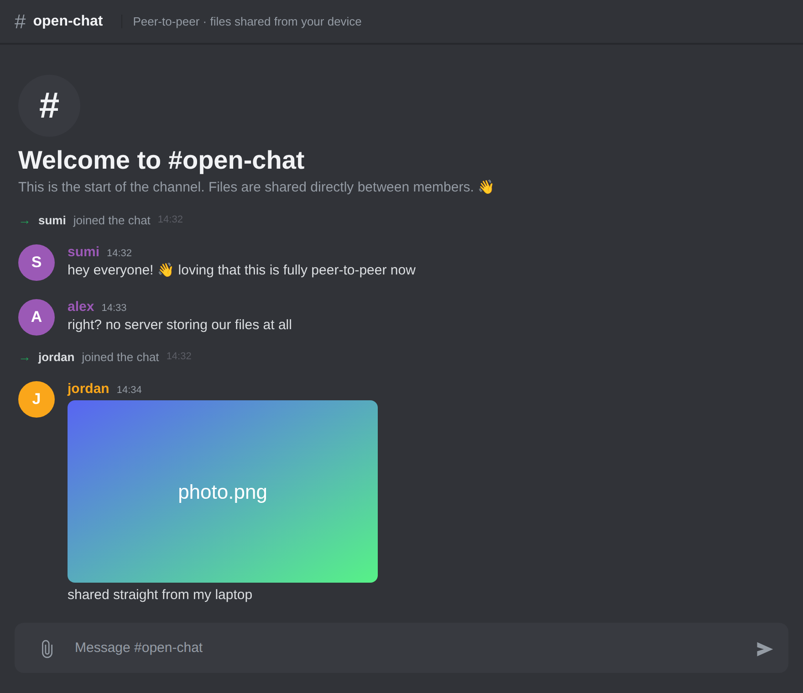
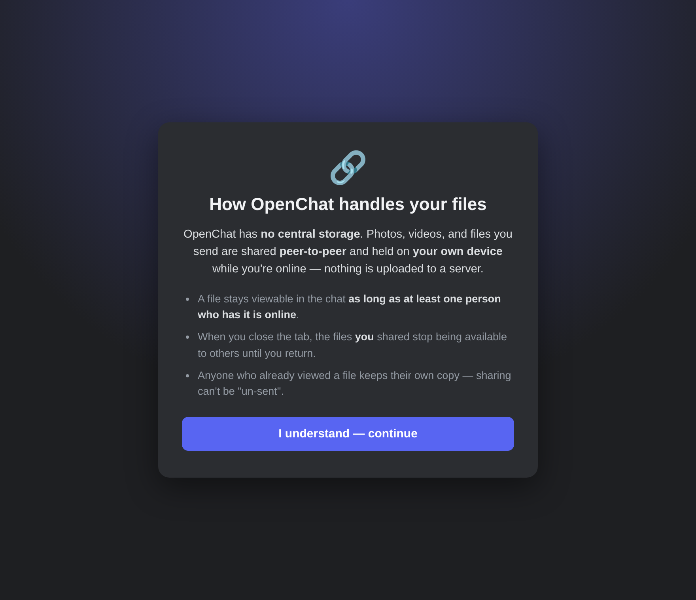

# OpenChat 💬

A real-time, **peer-to-peer** group chat built with Spring Boot and WebSocket.
Text messages travel over a WebSocket connection, while photos, videos, and files
are shared **directly between browsers** using WebTorrent — so there's **no central
file storage**. A file stays available in the chat as long as at least one person
who has it is online.

> A learning project exploring Spring Boot, WebSocket/STOMP, browser peer-to-peer
> file sharing, server security, and CI/CD.

## Screenshots

**The chat — Discord-style, with inline shared media:**



**On load, each member sees how files are handled:**



## Features

- **Real-time messaging** over WebSocket (STOMP + SockJS)
- **Clean, Discord-inspired dark UI** with per-user colored avatars
- **Join / leave notifications** rendered as subtle system messages
- **Peer-to-peer file sharing** (images, video, audio, PDFs, or any file) via
  [WebTorrent](https://webtorrent.io/) — files live on the sender's device, not a server
- **Hardened server:** locked WebSocket origins, message-size limits, per-session
  rate limiting, server-assigned identity (anti-impersonation), and input validation

## How it works

The Spring Boot server is a **coordinator / signaling hub** — it manages the live
session and relays chat messages and file *magnet links* over WebSocket. It never
stores or forwards the file bytes.

When you attach a file, your browser **seeds** it with WebTorrent and broadcasts a
tiny magnet link. Everyone else pulls the bytes **directly, peer-to-peer**, from
whoever is holding the file. When the last holder goes offline, the file is no
longer available — which is exactly the intended "no central storage" model.

```
You ──(magnet link over WebSocket)──▶ Server ──▶ Everyone
 └────────────(file bytes, direct P2P via WebTorrent)────────────▶ Friend
```

## Tech stack

- **Java 26** · **Spring Boot 4.1**
- Spring WebSocket (STOMP) · SockJS
- WebTorrent (in-browser peer-to-peer)
- Lombok · Maven

## Getting started

### Prerequisites

- **JDK 26**
- **Maven 3.9+**

### Run

```bash
git clone git@github.com:samxc/OpenChat.git
cd OpenChat
mvn spring-boot:run
```

Then open **http://localhost:8080**. To see peer-to-peer file sharing in action,
open the site in **two browser windows**, join with different names, and share a
photo in one — it transfers directly to the other.

## Security notes

This is a **public** chat, and it's important to be clear about what that means:

- Anyone with a file's magnet link can download it — sharing is **not**
  end-to-end encrypted. Don't send anything secret.
- Peers see each other's **IP addresses** (inherent to WebRTC / peer-to-peer).
- Transport encryption (TLS/WSS) and real user accounts are planned future work.

The server itself is hardened against impersonation, floods, and malformed input
(see the `security` package and the WebSocket configuration).

## License

For learning and demonstration purposes.
